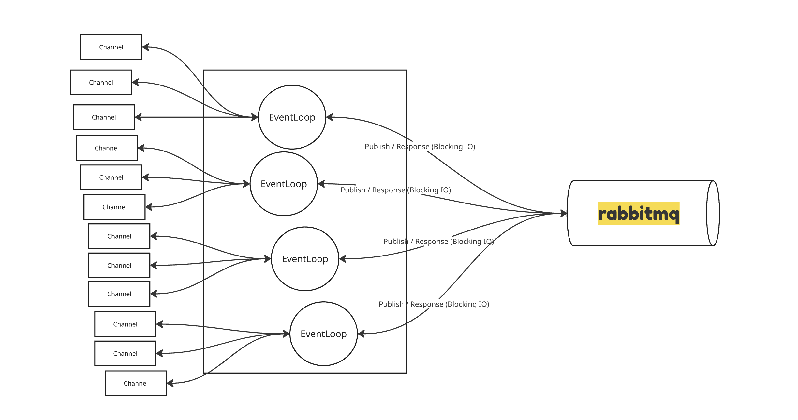
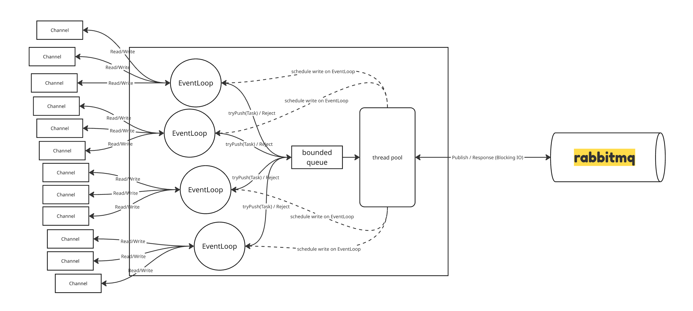
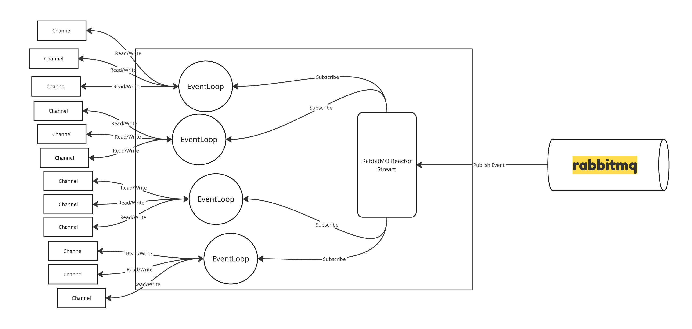
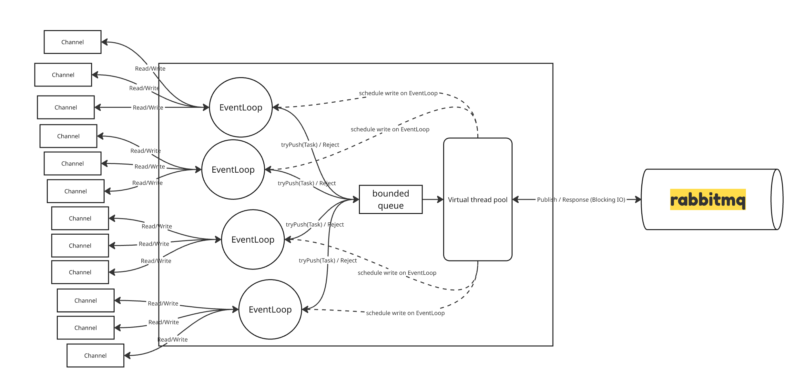

# ReadTimeout Gateway

## EventLoop Blocking 문제 재현 및 해결 방안 비교 프로젝트

Netty 기반 서버에서 **EventLoop Thread 블로킹**이 시스템 전체에 미치는 영향을 재현하고,
다양한 해결 방안(Non-blocking, Reactive, Virtual Thread)의 성능을 비교 분석합니다.

---

## 목차

1. [프로젝트 배경](#프로젝트-배경)
2. [아키텍처 비교](#아키텍처-비교)
3. [핵심 인사이트](#핵심-인사이트)
4. [부하 테스트 결과](#부하-테스트-결과)
5. [Backpressure 구현](#backpressure-구현)
6. [빠른 시작](#빠른-시작)
7. [결론 및 권장사항](#결론-및-권장사항)

---

## 프로젝트 배경

### 문제 상황

회사에서 운영 중인 Netty 기반 서버에서 다음과 같은 문제가 존재함
- EventLoop Thread에서 RabbitMQ 동기 호출

다양한 문서, 블로그에서 EventLoop 블로킹 문제 경고를 하고 있으며 실제로 이번해 8월경 대규모 장애는 아니였지만 EventLoop 블로킹으로 인해 서비스 지연이 발생한 적이 있음 
당시에 클라이언트 요청 시각과 서버 요청 수신 시각이 몇 초씩 차이나는 현상이 관찰되었으며, 그로 인해서 서비스는 응답지연으로 Read Timeout이 발생


### 왜 문제인가?

현재 회사 서비스 같은 경우는 동시 요청이 300 정도에 불과하지만, 계속적으로 세션수가 늘어나고 있으며 만약 세션이 2배, 3배 증가할 경우 무슨일이 벌어질까?
만약 1500 동시 요청 → EventLoop Thread 40개라고 가정하자.

만약에 극단적으로 모든 EventLoop Thread 40개가 RabbitMQ 호출로 블로킹이 된 상태라면?
- EventLoop Thread 40개 모두 블로킹으로, 해당 EventLoop에 연결된 1460개의 세션이 요청한 모든 요청이 지연
- 결국 일부의 요청으로 인해서 전체 서비스가 마비되는 상황 발생 

그렇기 떄문에 앞으로 세션이 더 늘어난다면? 장애 가능성은 더욱 커짐, 선제적인 조치가 필요함

---

## 아키텍처 비교

### 4가지 버전

| 버전 | 모드 | 포트 | 핵심 특징                         |
|------|------|------|-------------------------------|
| **V1** | Blocking | 8082 | EventLoop에서 직접 블로킹 (현재 아키텍처)  |
| **V2** | Non-blocking | 8083 | ThreadPool 오프로드 + Backpressure |
| **V3** | Reactive | 8084 | reactor-rabbitmq NIO 기반       |
| **V4** | Virtual Thread | 8085 | Java 21 Virtual Thread        |

### V1 Blocking (현재 아키텍처)

- EventLoop Thread에서 RabbitMQ 동기 호출하는 형태
- Publish 후 RabbitMQ로부터 응답을 받을 때까지 EventLoop가 블로킹됨

### V2 Non-blocking (ThreadPool 오프로드)

- EventLoop에서 RabbitMQ Publish를 ThreadPool로 오프로드하여 블로킹 회피
- 동시성 제한(Backpressure) 추가로 과부하 방지
- 만약 Backpressure가 설정이 안되어있으면 대량 트래픽이 들어올 경우 Thread가 고갈되어 처리 지연 및 장애 발생 가능
- 1 Request Per 1 Thread 모델이기 때문에 메모리 소모가 큼

### V3 Reactive (NIO 기반)

- reactor-rabbitmq 라이브러리를 사용하여 NIO 기반 비동기 호출
- reactor-rabbitmq는 RabbitMQ Java Client를 Reactive하게 감싼 라이브러리
- 반응형 패러다임으로, RabbitMQ I/O 작업이 완료되면 Publisher가 Stream에 이벤트를 발행하고 Subscriber인 EventLoop가 이를 처리
- I/O 작업 대기 시에도 스레드를 점유하지 않기 때문에 V2와 비교하여 메모리 소모가 훨씬 적음
- 동시에 컨텍스트 스위칭 오버헤드가 거의 존재하지 않기 때문에 CPU 사용률도 낮음

### V4 Virtual Thread

- Java 21의 Virtual Thread를 사용한 방식으로 V2와 유사하게 ThreadPool 오프로드 구조
- Virtual Thread는 경량 스레드로, 수천 개의 Virtual Thread를 생성해도 메모리 소모가 적음
- Virtual Thread는 OS 스레드와 1:1 매핑되지 않고, 필요에 따라 OS 스레드에서 실행되므로 많은 수의 동시 작업을 효율적으로 처리 가능
- V2와 비교하여 메모리 소모가 훨씬 적음
- RabbitTemplate에 synchronized 블록이 다수 포함되어 있어 Carrier Thread에 고정 되는 현상 발생 (사용 불가)
---

## 핵심 인사이트

| 항목               | V2 Non-blocking | V3 Reactive |
  |--------------------|-----------------|-------------|
| 스레드 수          | 50~100개        | 1~2개       |
| Context Switch/sec | 수천~수만       | 거의 0      |
| 시스템 콜          | 요청당 여러 번  | 배치 처리   |
| CPU 캐시 효율      | 낮음            | 높음        |

### 1. EventLoop 블로킹의 파급 효과

1. RabbitMQ의 일시적인 지연 발생
2. EventLoop Thread 블로킹 
3. 결국 EventLoop Thread에 할당된 모든 Channel에 지연이 발생함

### 2. 동시성 vs 처리속도

| | V2 (ThreadPool) | V3 (Reactive) |
|---|---|---|
| 동시 처리 | Thread 수만큼 | 제한 없음 (NIO) |
| RabbitMQ 호출 속도 | 동일 (1ms) | 동일 (1ms) |
| **차이점** | 대기 중 리소스 점유 | 경량 객체만 유지 |
| 1000개 대기 시 | ~1GB (스레드 스택) | ~수 MB (Mono) |

> **Reactive가 빠른 게 아니라, 버틸 수 있는 동시 요청 수가 많음**

### 3. Reactive의 핵심

```
전통적 방식: 요청 → [대기...] → 응답 (스레드 점유)
Reactive: 등록 → (스레드 반납) → 완료 시 처리

핵심: "기다리지 말고, 데이터가 오면 반응해라 (반응형 프로그래밍)"
```

**Burst 트래픽에 강한 이유**: 대기 = 리소스 점유가 없음

---

## 부하 테스트 결과

### 테스트 환경

- **k6**: 1500 VUs, 12분 ramp-up
- **RabbitMQ**: 3노드 클러스터 + Classic Mirroring
- **서버**: Docker 컨테이너 (동일 리소스)

### 성능 비교

| 메트릭 | V1 Blocking | V2 Non-blocking | V3 Reactive |
|--------|-------------|-----------------|-------------|
| **p95 Latency** | 500-2000ms | 50-150ms | 30-100ms |
| **p99 Latency** | 2000-5000ms | 150-300ms | 100-200ms |
| **EventLoop Lag** | 50-500ms | < 10ms | < 5ms |
| **성공률** | 50-80% | 75-85% | 95%+ |
| **처리량** | ~800 req/s | ~2,700 req/s | ~3,000 req/s |

<!-- 이미지: V1 vs V3 Latency 비교 그래프 -->


### EventLoop Lag 비교

<!-- 이미지: EventLoop Lag 비교 -->


| EventLoop Lag | 의미 |
|---------------|------|
| < 1ms | 정상 |
| 10-50ms | 부하 증가 중 |
| > 50ms | 병목 발생 |
| > 100ms | 장애 수준 |

---

### 테스트 방식

#### K6 부하 테스트 스크립트

```javascript
```

---

### 결론 
V1은 EventLoop 쓰레드가 블로킹 되는 것을 확인하였으며, 트래픽이 점차 증가함에 따라 EventLoop의 모든 쓰레드들이 블로킹 되는 현상을 관찰할 수 있었습니다.

V2, V3, V4는 EventLoop 블로킹 현상이 발생하지 않았으며 특히 V2와 V3 모두 안정적인 처리 성능을 보여주었습니다.
만약 V2, V3 중 하나를 선택해야 한다면, 아래와 같은 내용을 고려할 필요가 있습니다.

만약 서비스가 극단적인 버스트 트래픽이 자주 발생하는 서비스라면 V3 Reactive 아키텍처를 권장합니다.
- V3 Reactive 아키텍처는 NIO 기반으로 동작하기 때문에, 대량의 동시 요청이 들어오더라도 소수의 스레드로 처리할 수 있어 메모리 사용량이 적고, CPU 컨텍스트 스위칭 오버헤드가 낮아 효율적입니다.
- 반면에, V2 Non-blocking 아키텍처는 ThreadPool을 사용하기 때문에, 동시 요청이 많아질수록 스레드 수가 증가하여 메모리 사용량이 커지고, 컨텍스트 스위칭 오버헤드가 발생할 수 있습니다.

반대로 서비스가 비교적 안정적이고 예측 가능한 트래픽 패턴을 가지고 있다면 V2 Non-blocking 아키텍처도 충분히 좋은 선택이 될 수 있습니다.
- V2 Non-blocking 아키텍처는 구현이 비교적 간단하고, 기존 동기식 코드를 크게 변경하지 않고도 적용할 수 있는 장점이 있습니다.
- 또한, V2 Non-blocking 아키텍처는 예측 가능한 트래픽에서는 V3 Reactive 아키텍처에 비해 좀 더 좋은 처리 속도를 제공할 수 있습니다.
- 하지만 동시 요청이 급격히 증가할 경우, ThreadPool이 고갈되어 처리 지연 및 장애가 발생할 수 있으므로, 적절한 Backpressure 설정이 필요합니다.

극단적인 버스트 트래픽이 자주 발생하는 서비스이고, V3 Reactive 아키텍처를 도입하지 못하는 상황이라면 V4 Virtual Thread 아키텍처도 고려해볼 수 있습니다.
- Virtual Thread는 경량 스레드로, 수천 개의 Virtual Thread를 생성해도 메모리 소모가 적기 때문에, 대량의 동시 요청을 효율적으로 처리할 수 있습니다.
- 하지만 현재 RabbitTemplate에 synchronized 블록이 다수 포함되어 있어 Carrier Thread에 고정 되는 현상이 발생하므로, 실제 운영 환경에서는 사용이 어려울 수 있습니다.
- 만약에 해당 문제가 해결된다면, Virtual Thread 아키텍처는 V2 Non-blocking 아키텍처에 비해 메모리 사용량이 훨씬 적고, 동시 요청 처리 능력이 뛰어나므로 좋은 대안이 될 수 있습니다.

## 라이선스

이 프로젝트는 학습 목적으로 작성되었습니다.
